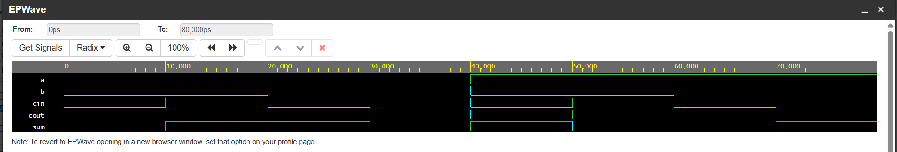

#  Hierarchical Half Adder & Full Adder Design

##  Project Overview
This project implements a structural, hierarchical binary arithmetic circuit in Verilog HDL. The module models a foundational **Half Adder** module and instantiates multiple copies of it to build a complete, industry-standard **Full Adder** circuit block capable of processing carry-in bits.

---

## Circuit Specifications & Signal Interface
The top-level Full Adder module processes three 1-bit inputs and computes the simultaneous arithmetic sum and carry-out logic.

* **Inputs:** * `a`   : Input data bit A
  * `b`   : Input data bit B
  * `cin` : Carry-in input bit from a previous stage
* **Outputs:**
  * `sum`  : Final arithmetic summation bit response
  * `cout` : Carry-out overflow bit response

---

##  Verification Truth Table
The simultaneous logic table below defines the exact behavior verified across all 8 possible binary addition combinations:

| Input A | Input B | Carry-In (`cin`) | Arithmetic Math | Sum (`sum`) | Carry-Out (`cout`) |
| :---: | :---: | :---: | :---: | :---: | :---: |
| **0** | **0** | **0** | 0 + 0 + 0 | 0 | 0 |
| **0** | **0** | **1** | 0 + 0 + 1 | 1 | 0 |
| **0** | **1** | **0** | 0 + 1 + 0 | 1 | 0 |
| **0** | **1** | **1** | 0 + 1 + 1 | 0 | 1 |
| **1** | **0** | **0** | 1 + 0 + 0 | 1 | 0 |
| **1** | **0** | **1** | 1 + 0 + 1 | 0 | 1 |
| **1** | **1** | **0** | 1 + 1 + 0 | 0 | 1 |
| **1** | **1** | **1** | 1 + 1 + 1 | 1 | 1 |

---

## Simulation & Verification Pipeline
The logic architecture was compiled and verified using the **Icarus Verilog 12.0** compiler engine. A testbench applied all 8 scalar configurations at continuous 10ns intervals to thoroughly test boundaries and logic transitions.

###  Verified Simulation Waveform
The functional timing diagram below validates accurate propagation delays and flawless binary math tracking across all states:

