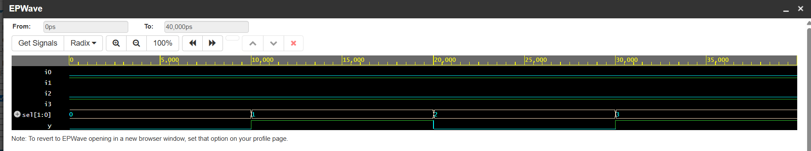

# Behavioral Modeling of a 4-to-1 Multiplexer (MUX)

## 📌 Project Overview
This repository contains a synthesis-ready behavioral modeling implementation of a **4-to-1 Multiplexer** in Verilog HDL. The module utilizes combinational hardware routing blocks configured via a continuous event-driven `always` block and an explicit execution `case` statement to select and forward data bits based on dynamic bus selection criteria.

---

##  Circuit Specifications & Signal Interface
The module accepts four individual scalar input channels and routes a single channel to the output based on a 2-bit tracking selection bus vector.

* **Data Inputs:** `i0`, `i1`, `i2`, `i3` (1-bit data lines)
* **Control Input:** `sel[1:0]` (2-bit hardware data selection routing bus)
* **Module Output:** `y` (1-bit dynamically switched output line)

---

##  Selection Routing Truth Table
The simultaneous behavioral table below outlines the conditional data mapping verified across the routing matrix:

| Selection Input `sel[1]` | Selection Input `sel[0]` | Active Routed Input Channel | Output State (`y`) |
| :---: | :---: | :---: | :---: |
| **0** | **0** | Channel 0 (`i0`) | Equals `i0` |
| **0** | **1** | Channel 1 (`i1`) | Equals `i1` |
| **1** | **0** | Channel 2 (`i2`) | Equals `i2` |
| **1** | **1** | Channel 3 (`i3`) | Equals `i3` |

---

##  Simulation & Verification Pipeline
The RTL architecture was compiled and verified using the **Icarus Verilog 12.0** verification framework. Stimulus vectors assigned alternating static binary states (`i0=0, i1=1, i2=0, i3=1`) while the select tracking line (`sel`) cycled sequentially from `2'b00` up to `2'b11` to capture tracking accuracy.

###  Verified Simulation Waveform
The functional timing diagram below validates zero-delay behavioral line switching and crisp output transitions exactly at the scheduled execution barriers:

