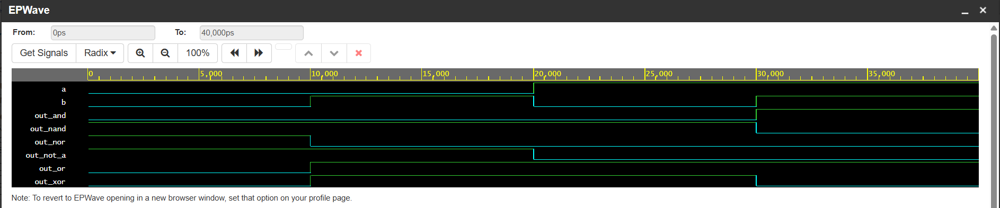

# Digital-Logic-Design
Practical implementation and simulation of basic and universal logic gates.
# 🎛️ Complete Logic Gates Design & Verification Pipeline

## 📌 Project Overview
This repository contains a foundational front-end digital design implementation modeling all primary and universal logic gates in Verilog HDL. The design has been fully verified using a behavioral testbench framework and validated through functional waveform simulation.

---

## ⚙️ Circuit Specifications & Signal Interface
The module accepts two single-bit scalar inputs and computes the simultaneous logic response for six distinct digital gates.

* **Inputs:** `a`, `b` (1-bit data lines)
* **Outputs:** 
  * `out_and`  : Bitwise AND logic
  * `out_nand` : Bitwise NAND logic
  * `out_or`   : Bitwise OR logic
  * `out_nor`  : Bitwise NOR logic
  * `out_not_a`: Bitwise NOT logic (Inverter for Input A)
  * `out_xor`  : Bitwise XOR logic

---

## 🔍 Functional Logic Definitions

* **AND Gate (`out_and`):** Outputs a high state (`1`) only if both inputs `a` and `b` are high.
* **NAND Gate (`out_nand`):** The universal inverse of the AND operation; outputs a low state (`0`) only when both inputs are high.
* **OR Gate (`out_or`):** Outputs a high state (`1`) if at least one input (`a` or `b`) is high.
* **NOR Gate (`out_nor`):** The universal inverse of the OR operation; outputs a high state (`1`) only when both inputs are completely low.
* **NOT Gate (`out_not_a`):** A standard logical inverter that flips the state of input `a`. If `a = 0`, the output is `1`, and vice versa.
* **XOR Gate (`out_xor`):** An Exclusive-OR gate that outputs a high state (`1`) only when the inputs are different (`a != b`). Essential for arithmetic adder circuits.

---

## 🧪 Simulation & Verification Pipeline
The RTL code was compiled and simulated using the **Icarus Verilog 12.0** engine on EDA Playground. A structured testbench script injected all four possible binary input combinations (`00`, `01`, `10`, `11`) at 10ns intervals.

### 📈 Verified Simulation Waveform
The functional timing diagram below validates that all outputs transition in perfect alignment with their behavioral truth tables:

---
*Developed as part of my front-end digital design and VLSI validation portfolio.*
