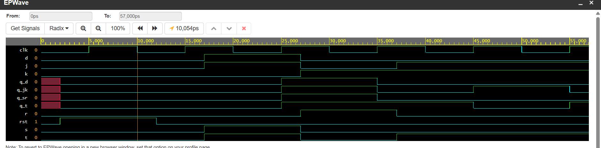

#  Unified Sequential Storage Suite (D, T, JK, & SR Flip-Flops)

##  Project Overview
This repository contains a unified, synthesis-ready collection of fundamental digital storage blocks implemented in Verilog HDL. Rather than separating basic components, this module groups **D, T, JK, and SR Flip-Flops** into a parallel-verified verification suite utilizing non-blocking assignments (`<=`) and active-high **Asynchronous Resets (`rst`)**.

---

##  Core Component Logic & Operation

### 1. D Flip-Flop (Data / Delay)
* **Behavior:** Captures the input data bit `d` exactly at the rising edge of the clock.
* **Equation:** $Q_{next} = D$

### 2. T Flip-Flop (Toggle)
* **Behavior:** Inverts its current state if the input `t` is high on the clock edge; otherwise, holds its value.
* **Equation:** $Q_{next} = T \oplus Q$

### 3. JK Flip-Flop (Universal Storage)
* **Behavior:** Eliminates the invalid state condition of standard latches. Sets, resets, holds, or toggles based on a 2-bit input matrix.
* **Logic Matrix:** `00` = Hold | `01` = Reset (0) | `10` = Set (1) | `11` = Toggle ($\bar{Q}$)

### 4. SR Flip-Flop (Set-Reset)
* **Behavior:** Foundational latch configuration. 
* **Logic Matrix:** `00` = Hold | `01` = Reset (0) | `10` = Set (1) | `11` = Indeterminate (`x`)

---

## Comprehensive Truth Table Matrix
All designs share an active-high asynchronous reset path that instantly clears outputs to `0` regardless of the clock state.

| Device | Reset (`rst`) | Clock (`clk`) | Inputs | Next State ($Q_{next}$) | Mode |
| :---: | :---: | :---: | :---: | :---: | :---: |
| **All Units** | **1** | X | X | **0** | **Asynchronous Clear** |
| **DFF** | 0 | Rising Edge (↑) | D = 1 | **1** | Synchronous Set |
| **TFF** | 0 | Rising Edge (↑) | T = 1 | **$\bar{Q}$** | Toggle State |
| **JKFF** | 0 | Rising Edge (↑) | J=1, K=1 | **$\bar{Q}$** | Toggle State |
| **SRFF** | 0 | Rising Edge (↑) | S=1, R=1 | **X** | **Invalid State** |

---

##  Parallel Simulation & Verification
The suite was compiled using the **Icarus Verilog 12.0** engine. The master testbench drives all four storage units simultaneously off a shared 100MHz clock signal to observe execution transitions side-by-side.

### Verified Waveform Capture
The timing diagram below showcases perfect synchronous data sampling and clear output state transitions across all four devices:

