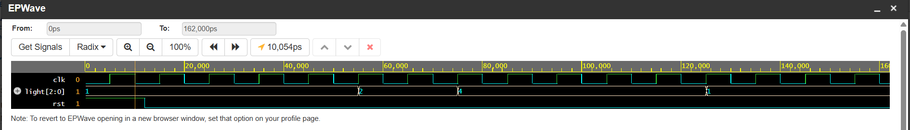

#  Finite State Machine (FSM) Traffic Light Controller

##  Project Overview
This project showcases a fundamental control engine design using a classic **Finite State Machine (FSM)** architecture implemented in synthesis-ready Verilog HDL. The module manages a standard 3-state intersection timing sequence (Green ➡️ Yellow ➡️ Red) by partitioning the hardware duties into an industry-standard **3-Process Always-Block Layout**.

---

##  FSM Architecture & State Transitions

The controller steps sequentially through three primary states based on an internal timer loop clocked by a system line:

1. **`S_GREEN` (State `2'b00`):** Activates the Green signal path for a duration of 5 clock cycles.
2. **`S_YELLOW` (State `2'b01`):** Activates the Yellow transitional signal path for a duration of 2 clock cycles.
3. **`S_RED` (State `2'b10`):** Activates the Red signal path to stop crossing traffic for a duration of 5 clock cycles before looping back to Green.

---

##  Hardware Logic Encoding Matrix

The 3-bit output vector map `light[2:0]` correlates directly to physical hardware pin outputs `[Red, Yellow, Green]`:

| Current State | Abstract State Encoding | Output Vector (`light[2:0]`) | Decimal Value on Waveform | Active Hardware Channel |
| :---: | :---: | :---: | :---: | :---: |
| **`S_GREEN`** | `2'b00` | `3'b001` | **1** | Green LED Pin High ($5\text{V}$) |
| **`S_YELLOW`** | `2'b01` | `3'b010` | **2** | Yellow LED Pin High ($5\text{V}$) |
| **`S_RED`** | `2'b10` | `3'b100` | **4** | Red LED Pin High ($5\text{V}$) |

---

##  Simulation Verification & Timing Waves
The circuit was compiled and verified using the **Icarus Verilog** simulator engine. The structural testbench drives the FSM through multiple full looping iterations to confirm glitch-free state transitions and count tracking.

###  Functional Waveform Output
The execution grid proves that the output values match our parameters precisely (`1` ➡️ `2` ➡️ `4` ➡️ `1`):

