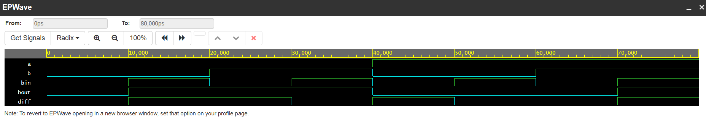

#  Hierarchical Half Subtractor & Full Subtractor Design

##  Project Overview
This project implements a structural, hierarchical binary subtraction circuit in Verilog HDL. The architecture models a foundational **Half Subtractor** module and instantiates two structural copies of it to build a complete **Full Subtractor** block capable of handling borrow-in bits from previous stages.

---

##  Circuit Specifications & Signal Interface
The top-level Full Subtractor module processes three 1-bit inputs and computes the simultaneous logical difference and borrow outputs.

* **Inputs:**
  * `a`   : Minuend input data bit
  * `b`   : Subtrahend input data bit
  * `bin` : Borrow-in input bit from a previous stage
* **Outputs:**
  * `diff` : Final logical difference bit response
  * `bout` : Borrow-out output bit response

---

##  Verification Truth Table
The simultaneous truth table below defines the exact arithmetic behavior verified across all 8 possible binary subtraction combinations:

| Input A | Input B | Borrow-In (`bin`) | Arithmetic Expression | Difference (`diff`) | Borrow-Out (`bout`) |
| :---: | :---: | :---: | :---: | :---: | :---: |
| **0** | **0** | **0** | 0 - 0 - 0 | 0 | 0 |
| **0** | **0** | **1** | 0 - 0 - 1 | 1 | 1 |
| **0** | **1** | **0** | 0 - 1 - 0 | 1 | 1 |
| **0** | **1** | **1** | 0 - 1 - 1 | 0 | 1 |
| **1** | **0** | **0** | 1 - 0 - 0 | 1 | 0 |
| **1** | **0** | **1** | 1 - 0 - 1 | 0 | 0 |
| **1** | **1** | **0** | 1 - 1 - 0 | 0 | 0 |
| **1** | **1** | **1** | 1 - 1 - 1 | 1 | 1 |

---

##  Simulation & Verification Pipeline
The logic architecture was compiled and verified using the **Icarus Verilog 12.0** engine on EDA Playground. The testbench framework sequentially forced all 8 input configurations at continuous 10ns intervals to exhaustively verify truth table compliance.

### Verified Simulation Waveform
The functional timing diagram below validates accurate propagation delays and flawless binary subtraction tracking across all computational states:

